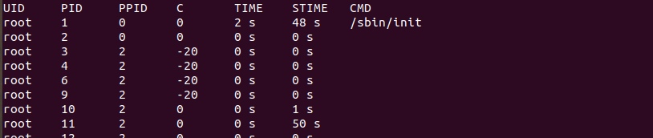
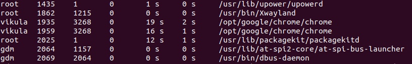

[](https://travis-ci.org/ViktoriaGatz/file_system_C)
### Лабораторная 2. Работа с файловой системой. Создание проекта «Управление файловой системой»

* Язык программирования: С/С++
* Срок выполнения: 2 недели

### Требования:
* В проекте должен обрабатываться аргумент "--help|-h" для вывода справки, в которой отображаются:
    1. Авторы;
    2. Все доступные аргументы;
    3. Краткое описание проекта;
    4. Примеры запуска.
* Сборка проекта осуществляется с помощью Make/CMake
* Нельзя использовать встроенные в Linux программы
* Проект должен обязательно содержать следующий функционал:
    1. Перемещение файла;
    2. Копирование файла;
    3. Удаление файла;
    4. Подсчет общего размера указанной директории или файла;
    5. Отображение всех файлов в указанной директории;
    6. Отображение всех процессов из файловой системы procfs. (http://manpages.ubuntu.com/manpages/precise/ru/man5/proc.5.html)

### Примеры запуска
* ````./bin/proc --help # вывод меню помощи````
* ````./bin/proc --move ./file.txt ./bin/file.txt # переместить файл file.txt из текущей директории в папку bin````
* ````./bin/proc --copy ./file.txt ./bin/file.txt # копировать файл file.txt из текущей директории в папку bin````
* ````./bin/proc --delete ./file.txt # удалить файл file.txt из текущей директории````
* ````./bin/proc --scope ./file.txt # узнать размер файла file.txt````
* ````./bin/proc --scope ./bin # узнать размер директории bin````
* ````./bin/proc --ls ./bin # отобразить название всех файлов в директории bin````
* ````./bin/proc --procfs # отобразить все процессы файловой системы procfs````

### Сборка и запуск
* ````$ make # сборка````                 
* ````$ ./bin/proc # запуск без установки````                  
* ````$ make install # установка````                 
* ````$ proc # запуск````               
* ````$ make uninstall # удаление````                 

### Подробнее о procfs
**proc - псевдо-файловая система с информацией о процессах и системе**      

По запросу:       
````./bin/proc --procfs # отобразить все процессы файловой системы procfs````         

Выводится следующая информация:

1. UID - идентификатор пользователя;
2. PID - идентификатор процесса;
3. PPID - идентификатор родительского процесса. Родителем всех процессов является процесс init с PID равным 1;
4. C - приоритет процесса, используемый планировщиком задач (-20 - наивысший приоритеть, 19 - минимальный приоритет);
5. STIME - время, которые данный процесс провел в режиме ядра;
6. TIME - время, которые данный процесс  провел  в  режиме пользователя;
7. CMD - команда, запустившая данный процесс;



